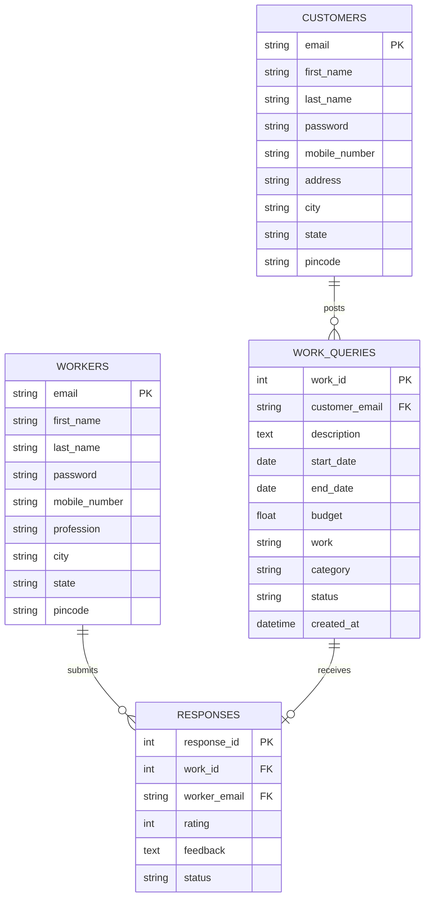

# 🏠 HomeMend

**A freelancing platform connecting households with skilled workers from the unorganised sector.**

HomeMend bridges the gap between households seeking home services and independent workers such as plumbers, electricians, carpenters, painters, and technicians. Customers can post work requests, workers in the same city and matching profession can browse and accept jobs, and the entire lifecycle - from posting to payment to feedback - is managed through the platform.

---

## 📑 Table of Contents

- [Features]
- [Tech Stack]
- [Project Structure]
- [Prerequisites]
- [Installation & Setup]
- [Running the Application]
- [Database Schema]
- [API Reference]
- [Frontend Routes]
- [Screenshots / Pages]
- [Testing]
- [Contributing]
- [License]

---

## ✨ Features

### For Customers (Households)
- **Registration & Login** - Create an account with personal and address details
- **Profile Management** - View and edit profile information
- **Post Work Requests** - Submit jobs specifying work type, date range, description, budget, and service category
- **Track Requests** - View all posted work queries with real-time status (Pending → Accepted → Paid → Completed)
- **Cancel Requests** - Cancel pending or accepted work queries
- **Online Payment** - Pay workers securely via Stripe integration
- **Mark Completion** - Confirm when the work is done
- **Rating & Feedback** - Rate workers (1–5 stars) and leave written feedback after job completion

### For Workers (Service Providers)
- **Registration & Login** - Sign up with profession selection (Plumber, Electrician, Painter, Carpenter, Technician)
- **Profile Management** - View and edit profile information
- **Browse Nearby Jobs** - View pending work queries in the same city that match the worker's profession
- **Accept Jobs** - Accept available work requests
- **Track Accepted Jobs** - Monitor the status of all accepted work with customer details
- **View Feedback** - See ratings and feedback left by customers after job completion

### Platform-Wide
- **City-based Job Matching** - Workers only see jobs posted by customers in the same city with matching service category
- **Status Workflow** - Clear status progression: `Pending` → `Accepted` → `Paid` → `Completed`
- **Responsive Design** - Bootstrap 5-based responsive UI with Raleway typography
- **Stripe Payment Integration** - Secure card-based online payments

---

## 🛠 Tech Stack

### Frontend
| Technology | Purpose |
|---|---|
| **React 18** | UI library |
| **Vite 5** | Build tool & dev server |
| **React Router DOM 6** | Client-side routing |
| **Bootstrap 5 & React-Bootstrap** | UI components & responsive grid |
| **Axios** | HTTP client (available) |
| **Stripe.js + React Stripe** | Payment integration |
| **Font Awesome & Bootstrap Icons** | Iconography |
| **React Icons** | Additional icon sets |
| **React Scroll** | Smooth scrolling for landing page |
| **Raleway (Google Fonts)** | Primary typeface |

### Backend
| Technology | Purpose |
|---|---|
| **Flask** | Python web framework |
| **Flask-SQLAlchemy** | ORM for database operations |
| **Flask-CORS** | Cross-Origin Resource Sharing |
| **Flask-Migrate** | Database migrations (configured) |
| **SQLite** | Lightweight relational database |

---

## 📁 Project Structure

```
HomeMend/
├── app.py                  # Flask backend - all API routes
├── models.py               # SQLAlchemy database models
├── test_units.py           # Unit tests for models and DB operations
├── package-lock.json       # Root-level package lock
│
├── instance/
│   └── app.db              # SQLite database file
│
└── homemend/               # React frontend (Vite project)
    ├── index.html           # Entry HTML with CDN links & global font
    ├── package.json         # Frontend dependencies & scripts
    ├── vite.config.js       # Vite configuration
    ├── eslint.config.js     # ESLint configuration
    │
    ├── public/
    │   ├── img/             # Static images (service icons, carousel, about)
    │   └── vite.svg         # Vite favicon
    │
    └── src/
        ├── main.jsx         # React entry point
        ├── App.jsx          # Root component with routing
        ├── App.css          # Global app styles
        ├── index.css        # Base styles
        │
        ├── assets/
        │   └── react.svg
        │
        └── components/
            ├── HomePage.jsx         # Landing page (Carousel + Services + About + Process + Footer)
            ├── HomeCarousel.jsx     # Hero carousel on landing page
            ├── Nav.jsx              # Public navigation bar
            ├── Nav_user.jsx         # Customer dashboard navigation
            ├── Nav_worker.jsx       # Worker dashboard navigation
            ├── ServiceIcons.jsx     # Service category cards (Carpenter, Technician, Plumber, Painter, Electrician)
            ├── AboutSection.jsx     # About Us section
            ├── ProcessSection.jsx   # "How It Works" - 3-step process
            ├── Footer.jsx           # Site footer
            ├── ScrollToTopButton.jsx# Scroll-to-top utility button
            │
            ├── Login.jsx            # Sign In / Sign Up with role toggle (User/Worker)
            ├── Login.module.css     # Login page styles (CSS Modules)
            ├── Login.css            # Alternative login styles
            │
            ├── UserDashboard.jsx    # Customer dashboard
            ├── UserCarousel.jsx     # Customer dashboard carousel
            ├── Service.jsx          # Service selection page
            ├── ServicesSidebar.jsx  # Service category sidebar
            ├── RequestForm.jsx      # Work query submission form
            ├── ViewRequests.jsx     # Customer's posted requests with status, payment, completion & feedback
            ├── Profile.jsx          # Customer profile edit page
            │
            ├── WorkerDashboard.jsx  # Worker dashboard
            ├── WorkerCarousel.jsx   # Worker dashboard carousel
            ├── NearbyQuery.jsx      # Browse & accept nearby pending jobs
            ├── AcceptedQuery.jsx    # View accepted jobs with customer details & feedback
            ├── ProfileWorker.jsx    # Worker profile edit page
            │
            ├── Stripe.jsx           # Stripe checkout form for payments
            ├── PayNowButton.jsx     # Payment trigger button
            ├── PaymentSuccess.jsx   # Payment success confirmation
            │
            ├── corousel.jsx         # Shared carousel utility component
            │
            └── *.css                # Component-specific stylesheets
```

---

## 📋 Prerequisites

- **Python 3.8+**
- **Node.js 18+** and **npm**
- **pip** (Python package manager)

---

## 🚀 Installation & Setup

### 1. Clone the Repository

```bash
git clone https://github.com/<your-username>/HomeMend.git
cd HomeMend
```

### 2. Backend Setup

```bash
# Create a virtual environment (recommended)
python -m venv venv

# Activate the virtual environment
# Windows:
venv\Scripts\activate
# macOS/Linux:
source venv/bin/activate

# Install Python dependencies
pip install flask flask-sqlalchemy flask-cors flask-migrate
```

### 3. Frontend Setup

```bash
cd homemend
npm install
```

---

## ▶ Running the Application

### Start the Backend (Flask API)

From the project root (`HomeMend/`):

```bash
python app.py
```

The Flask server will start at **http://localhost:5000**

### Start the Frontend (React + Vite)

In a separate terminal, from the `homemend/` directory:

```bash
cd homemend
npm run dev
```

The Vite dev server will start at **http://localhost:5173**

> **Note:** Both servers must be running simultaneously. The frontend makes API calls to `http://localhost:5000` (or `http://127.0.0.1:5000`).

---

## 🗄 Database Schema

The application uses SQLite with 4 main tables:



### Status Lifecycle

| Status | Description |
|---|---|
| `Pending` | Work query posted by customer, awaiting worker |
| `Accepted` | A worker has accepted the job |
| `Paid` | Customer has completed payment via Stripe |
| `Completed` | Customer confirms the work is done |

---

## 📡 API Reference

Base URL: `http://localhost:5000`

### Customers

| Method | Endpoint | Description |
|---|---|---|
| `POST` | `/customers` | Register a new customer |
| `POST` | `/customers/login` | Customer login |
| `GET` | `/customers/<email>` | View customer profile |
| `PUT` | `/customers/<email>` | Edit customer profile |
| `GET` | `/customers/<email>/work_queries` | View all work queries by customer (with worker & response details) |

### Workers

| Method | Endpoint | Description |
|---|---|---|
| `POST` | `/workers` | Register a new worker |
| `POST` | `/workers/login` | Worker login |
| `GET` | `/workers/<email>` | View worker profile |
| `PUT` | `/workers/<email>` | Edit worker profile |
| `GET` | `/workers/<email>/nearby_queries` | View pending queries in worker's city matching their profession |

### Work Queries

| Method | Endpoint | Description |
|---|---|---|
| `POST` | `/work_queries` | Create a new work query |
| `DELETE` | `/work_queries/<work_id>` | Delete a work query and its associated response |
| `PATCH` | `/work_queries/<work_id>/pay` | Update status to "Paid" |
| `PATCH` | `/work_queries/<work_id>/complete` | Update status to "Completed" (must be "Paid" first) |

### Responses

| Method | Endpoint | Description |
|---|---|---|
| `PATCH/POST` | `/<work_id>/accept` | Worker accepts a work query (creates a Response record) |
| `GET` | `/work_queries/<work_id>/responses` | View responses for a specific work query |
| `GET` | `/<worker_email>/responses` | View all responses made by a worker (with customer details) |
| `POST` | `/responses/feedback` | Submit feedback for a response |
| `POST` | `/responses/rating` | Submit a rating for a response |

---

## 🗺 Frontend Routes

| Path | Component | Description |
|---|---|---|
| `/` | `HomePage` | Landing page with carousel, services, about, process & footer |
| `/login` | `Login` | Sign In / Sign Up page with User/Worker role toggle |
| `/user` | `UserDashboard` | Customer dashboard |
| `/worker` | `WorkerDashboard` | Worker dashboard |
| `/services` | `Service` | Service selection with sidebar and request form |
| `/userProfile` | `Profile` | Customer profile editor |
| `/workerprofile` | `ProfileWorker` | Worker profile editor |
| `/addedRequests` | `ViewRequests` | Customer's work queries with status, cancel, pay, complete & feedback |
| `/nearbyworks` | `NearbyQuery` | Worker's view of nearby matching pending jobs |
| `/acceptedworks` | `AcceptedQuery` | Worker's accepted jobs with customer details |
| `/stripe` | `Stripe` | Stripe payment checkout page |

---

## 🖥 Screenshots / Pages

The application consists of the following key pages:

1. **Landing Page** - Hero carousel, service category icons (Carpenter, Technician, Plumber, Painter, Electrician), about section, 3-step process ("Add Your Work Request" → "Meet The Experts" → "Get Best Services At Door"), and footer
2. **Login/Register** - Animated slide-over form with User/Worker role toggle, supporting both sign-in and sign-up
3. **Customer Dashboard** - Personalized dashboard with carousel and navigation to services, requests, and profile
4. **Service & Request Form** - Browse service categories and submit a work query with dates, description, and budget
5. **View Requests** - Card-based list of all posted work queries with status badges, cancel/pay buttons, completion confirmation, and star-based feedback
6. **Worker Dashboard** - Personalized dashboard with navigation to nearby jobs, accepted jobs, and profile
7. **Nearby Works** - List of pending work queries in the worker's city matching their profession, with accept buttons
8. **Accepted Works** - Accepted jobs with customer contact details, status tracking, and feedback display
9. **Stripe Payment** - Secure card payment form powered by Stripe Elements
10. **Profile Pages** - Editable profile forms for both customers and workers

---

## 🧪 Testing

Unit tests are located in `test_units.py` and cover model creation and database interaction mocking for all four models.

```bash
# From the project root
python -m unittest test_units.py
```

### Test Coverage

| Test Class | Tests |
|---|---|
| `TestCustomerModel` | Customer object creation, DB session mock |
| `TestWorkerModel` | Worker object creation, DB session mock |
| `TestWorkQueryModel` | Work query creation, DB session mock |
| `TestResponseModel` | Response creation, DB session mock |

---

## 🤝 Contributing

1. Fork the repository
2. Create a feature branch (`git checkout -b feature/your-feature`)
3. Commit your changes (`git commit -m 'Add your feature'`)
4. Push to the branch (`git push origin feature/your-feature`)
5. Open a Pull Request

---

## 📄 License

This project is open source. Add a license file to specify terms of use.

---

## ⚠ Known Limitations / Notes

- **Passwords are stored in plain text** - The codebase has comments noting that password hashing should be implemented for production use
- **No JWT/session-based authentication** - Login state is managed via `localStorage` (storing the user's email); there is no token-based auth
- **Stripe test mode** - The Stripe integration uses a test publishable key
- **SQLite** - Suitable for development; consider PostgreSQL or MySQL for production
- **Single worker per job** - The `WorkQuery ↔ Response` relationship is one-to-one (`uselist=False`)
